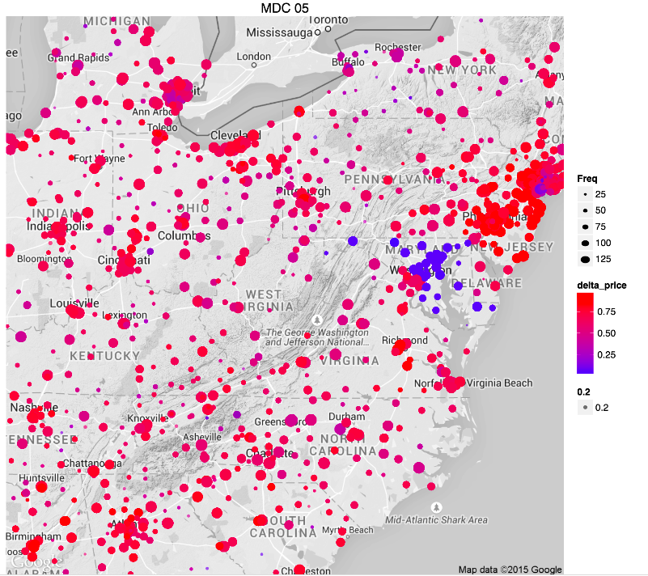
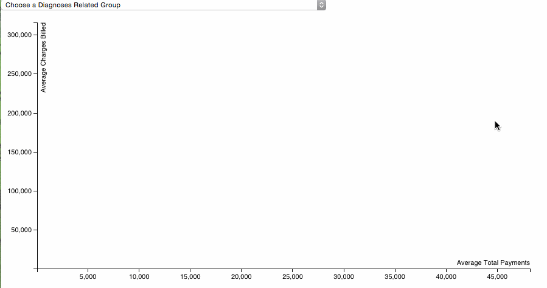

#Hospital Prices data

### CMS Medicare data (FY 2011)
*HospitalPrices.csv*
### Description:
In an effort to increase price transparency, the Centers for Medicare and Medicaid Services (CMS) have publicly released a data set showing what hospitals charged and what Medicare paid for the 100 most common Medicare inpatient stays (Diagnostic Related Groups or DRGs) in 2011. And on June 3, 2013 CMS also released an outpatient data set, containing charges and Medicare payments for 30 select Ambulatory Payment Classification Codes (APCs), by facility.

[Originally posted here](http://visualizing.org/contests/visualizing-hospital-price-data)

### Fields

* __DRG:__ Diagnoses related group (reason for any given patient visit)
* __ID:__ Provider ID for Hospital
* __Name:__ Name of Hospital
* __Street, City, State, Zip:__ Location
* __Region__: US Region
* __TotalDischarges (int)__: Number of patients seen for DRG in this Hospital for the year
* __AverageCoveredCharges (int):__ Average amount charged by hospital 
* __AverageTotalPayments (int):__ Average amount paid by Medicare
* __type:__ Outpatient or Inpatient
* __lat, lon:__ Geo coordinates (from Yahoo Maps API)

###Thanks

Many thanks to all who came out to the [data jam](http://www.meetup.com/Houston-Data-Visualization-Meetup/events/222584305/) and built some visualizations with us!  We'll do this again. 

### Projects

[geo plots] (https://github.com/timabram/houston-june-datajam) in [R] with [ggplot2](http://ggplot2.org/) and [ggmap](https://sites.google.com/site/davidkahle/ggmap) (http://www.r-project.org/)
from Tim, Aditi, Orion, Rocio, and team

an [interactive diagnoses group explorer](http://bl.ocks.org/micahstubbs/2697195b31c93bb3147a) in [d3js](d3js.org)
from Leann, Javier, & Micah

mapping onto bodies with Python 
Muxin, Neeraj, and team
